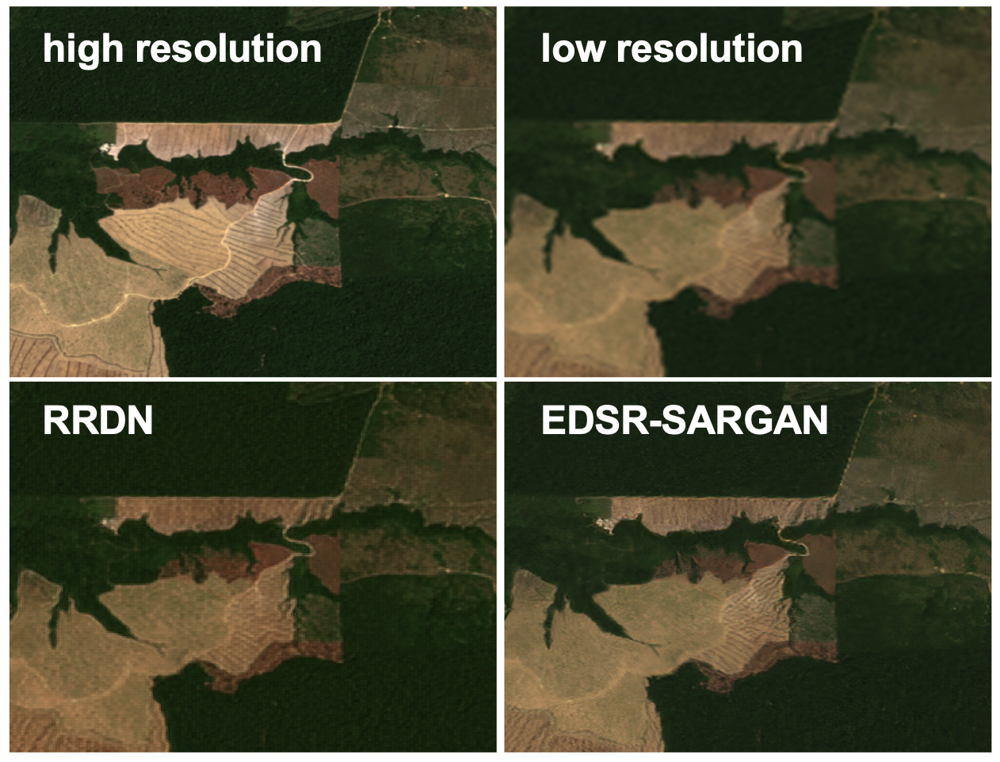

# Super-Resolution for SouthPole

#### -- Project Status: [Active]

## Project Intro/Objective
The purpose of this project is to assess whether super resolution techniques can be used for obtaining the required resolution on historic Landsat satellite imagery with sufficient reliability. Corresponding images from Landsat (30m, medium resolution) and Sentinel 2 (10m, high resolution) will be used to train a model to produce super-resolution images from lower-resolution images.  

### Partners
* [SIT Academy](https://sit.academy)
* [SouthPole](https://www.southpole.com)

### Methods Used
* Google Earth Engine python API 
* Data Visualization 
* Deep Learning 
* Statistical Analysis

### Technologies
* Python
* Google Earth Engine Python API
* Pandas, Matplotlib, Numpy, Earthpy, gdal, imageio
* TensorFlow2
* Super-resolution models (RDN, RRDN, EDSR, SRGAN)
* Google Colab, PyCharm

## Project Description
[SouthPole](https://www.southpole.com) is a company that works with businesses and governments across the globe to implement carbon emission reduction, climate action and sustainability projects. One of the issues targeted is deforestation, a practice that dramatically reduces the capacity for carbon sequestration within ecosystems across the globe. To assess the impact of these interventions (such as creation of protected national parks/safari reserves, introduction of effective farming techniques to the community, etc.), SouthPole needs to use satellite imagery to compare the amount of carbon sequestered in a given geographical region before and after an intervention (usually a period of 7-10 years). As high-resolution satellite imagery has not been around for many years and only low-resolution images are available for the baseline period, generating sufficiently-accurate analyses for the baseline is often difficult, resulting in lots of manual labor.

To address this problem, we leveraged Deep Learning models for Image Super-Resolution: training a convolutional neural network to upscale low-resolution satellite images to make them more comparable to high-resolution images. To obtain a dataset of low-high resolution image pairs for training the Super-Resolution model, we used the python API for Google Earth Engine, acquiring images from Lansdat 8 (30 m/pixel resolution) and Sentinel-2 (10 m/pixel resolution). The geographical locations were chosen from regions with high deforestation rates. After filtering out cloudy and faulty images and temporally matching the Landsat-Sentinel pairs to be taken within a maximum of 7 days of each other, a dataset of 800 quality image pairs was obtained.  

The implemented networks include:
- Residual Dense Network (RDN) 
    - [Residual Dense Network for Image Super-Resolution](https://arxiv.org/abs/1802.08797)
- Residual in Residual Dense Network (RRDN) 
    - [Residual Dense Network for Image Super-Resolution](https://arxiv.org/abs/1609.04802)
- EDSR 
    - [Enhanced Deep Residual Networks for Single Image Super-Resolution](https://arxiv.org/abs/1707.02921)
- SRGAN 
    - [Photo-Realistic Single Image Super-Resolution Using a Generative Adversarial Network](https://arxiv.org/abs/1609.04802)

After training our models on the gold-standard DIV2K dataset as well as our own Landsat-Sentinel satellite image pair data, testing different hyperparameters and fine-tuning, we achieved super-resolution images that surpassed the benchmark (bicubic-interpolated) images. Models with adversarial components (RRDN and SRGAN EDSR) produced the best-looking results. A gradient-based sharpness index was used as a metric to evaluate the models’ predictions in comparison to the baseline low-resolution images and the target high-resolution images.  

To conclude, we successfully developed a proof-of-concept for using Deep Learning based image Super-Resolution models to upscale low-resolution satellite images. The resulting images may facilitate the assessment of intervention impact on carbon sequestration in the geographical regions where climate action projects have been carried out. Future scope includes training these models on more data from diverse regions as well as trying newer Super-Resolution model architectures powered by Transformers.

## Getting Started

1. Clone this repo (for help see this [tutorial](https://help.github.com/articles/cloning-a-repository/)).
2. Source the data from Google Earth Engine (see notebooks/data_sourcing_and_processing) or download a pre-made dataset (see link in Data section below).
3. Set up and train the models (see notebooks/modeling)
4. Evaluate results (see notebooks/evaluation)

## Notebooks
The included notebooks allow you to source satellite images from Google Earth Engine, pre-process them, and build a training dataset. Models can be set up and trained, and the results can be evaluated. It is recommended to run these notebooks in Google Colab, to make use of the GPU runtime.
Directory structure:
- data_sourcing_and_processing
- modeling
    - prediction
    - training
- evaluation

## Data
Training data available as both un-processed images (TIF, downloaded directly from Google Earth Engine) as well as pre-processed images (PNG format, scaled and standardized).
- [TIF](https://drive.google.com/drive/folders/1e-1zEiUvdpy1k7oCPd5dLS-dGsck53j1?usp=sharing)
- [PNG](https://drive.google.com/drive/folders/1wLXQaNyyVODCoV7bcUnIwVbO_NyxciqR?usp=sharing)

Sourced from Google Earth Engine: 
- [Landsat 8](https://developers.google.com/earth-engine/datasets/catalog/LANDSAT_LC08_C01_T1_SR)
- [Sentinel-2](https://developers.google.com/earth-engine/datasets/catalog/COPERNICUS_S2_SR)

The [DIV2K dataset](https://data.vision.ee.ethz.ch/cvl/DIV2K/) can also be used for training (e.g.,  prior to transfer learning). It is important to use the 3x-downscaled DIV2K dataset in order to create a model compatible with satellite data, as the landsat-sentinel resolution difference is 3x. 

## Weights
Download some pre-trained model weights to test on your images. Weights are available [here](https://drive.google.com/drive/folders/1rLrNwGO0f0oWmqHcHaC0n2KpWGCp5Nuw?usp=sharing) for the RRDN and EDSR-SRGAN models. 

## Sources
 - [Image Super-Resolution (ISR)](https://github.com/idealo/image-super-resolution)
 - [Single Image Super-Resolution with EDSR, WDSR and SRGAN](github.com/krasserm/super-resolution)
 - [Sewar](https://github.com/andrewekhalel/sewar)
 - [Image Similarity Measures](https://github.com/up42/image-similarity-measures)

## Contributing Members

 - [Elena Gronskaya](https://github.com/egronskaya)
 - [Özgün Haznedar](https://github.com/ozgunhaznedar)

--------------------------------------------------------------------------------------
## Daily Notes (a three-week journal from start of project to completion)

* W1D1 *
    - introductory project discussion between SIT Academy and SouthPole
    - exploration of Google Earth Engine (GEE) interface, documentation, and datasets 
* W1D2 *
    - familiarization with the GEE Python API
    - writing scripts for data visualization and export 
    - overnight export of same-day Landsat-Sentinel images from Zurich and Amazon regions (68*2 + 10*2 images in 2.5 hours)
* W1D3 *
    - compilation of questions for SouthPole
    - exploration of other data visualization libraries (gdal and earthpy)
    - exploration of images to achieve similar contrast 
* W1D4 *
    - working on selecting non-cloudy images automatically
    - finding forested yet low-cloud areas across the globe, downloading image pairs
    - reading about scaling/luminance adjustments
* W1D5 *
    - we made a notebook called tif_exporter_moving square. The notebook does the following: 
        - export multiple images from landsat and sentinel with a given LAT/LONG coordinate,
        - algoritmically moves the coordinates to scan multiple regions   
        - as inputs we give lon, lat, folder name to export , spatial coverage of each image and cloud thresholds
        - we can target and download only the images that have a cloud score below a certain threshold
        - we can download hundreds of images (most of them cloud free) from a given location
    - we made another notebook called tif_pairwise_plotter. The notebook does the following:
        - imports image files from the download directory and converts them to numpy arrays
        - scales landsat and sentinel images seperately to RGB scale by linear transformation
        - plots the images pairwise 
        - it can filter out the images that are cloudy 
* W2D1 *
    - Second meeting with South Pole.
        - We showed them our image samples and got their confirmation to proceed with our image collection method.
        - We agreed that the time difference pair of images should not exceed 7 days
    - Updated our tif_exporter notebook to filter out image pairs that are more than 7 days apart
    - Updated our plotter notebook to filter out cloudy and bad-pixel-containing  images. 
    - Started downloading image pairs from Amazons, Madagascar, Honduras, Angola/DRC, and California.
* W2D2 *
    - Data collection completed from different regions : Amazon, Angola, Australia, California, Honduras, Madagaskar, Portugal
    - Images are selected from areas of deforestation
    - tif_exporter_moving_square notebook is used to download images from a selected region
    - tif_filtering_post_download notebook is used to algoritmically filter out cloudy and partially black out images
    - tif_manual_filtering notebook is used to manually filter out cloudy and non-informative images
* W2D3 *
    - continued data sourcing, with focus on manual filtering of auto-filtered datasets
    - background reading on super-resolution models 
* W2D4 *
    - Explored the repository https://github.com/idealo/image-super-resolution 
    - Updated ISR code to work with GEOTIFF images, with appropriate RGB scaling for sentinel/landsat 
    - Updated ISR code to run predictions on GEOTIFF data in batch mode. 
    - Ran test predictions using pre-trained weights of the RDN model on the California dataset to get pre-finetuning baseline
* W3D1 *
    - Train - Validation split 
        - Moved all 1'554 images in a single folder , 
        - Ran the notebook train_val_split.ipynb
        - Random shuffling of images
        - Train size: 660 pairs
        - Validation size : 117 pairs  
    - Image scaling
        - discovered that dataset contains small (1-3 pixel) mismatches in size 
        - discovered that the pre-trained weights of the ISR models are only applicable to 2x (for RDN) and 4x (for SRGAN) scaled images, while the difference between sentinel and landsat is 3x. Thus, available pre-trained weights cannot be used. 
    - RRDN and RDN model training on DIV2k-3x
        - Downloaded DIV2k data with 3 times downscaled LR images to use for training RRDN and RDN models of ISR repository
        - Trained 50 epochs of RRDN with only generator PSNR 
        - Trained RDN large and small models on DIV2k 
* W3D2 *
    - RRDN and RDN model training on DIV2k 
        - Trained RRDN for another 50 epochs with discriminator and feature extractor
    - Metrics
        - implemented sewar library for computing similarity metrics between images 
    - Meeting with SouthPole
* W3D3 *
    - image pre-processing/standardization: ran conversion of raw tiff images into images scaled and resized to 265 px (landsat) and 795 px (sentinel)
    - RRDN model training on DIV2k+landsat-sentinel dataset (on raw images, pre-processed within modified ISR package)
        -hyperparameter exploration
* W3D4 *
    - RRDN and RDN model training on DIV2k+landsat-sentinel dataset (on raw images, pre-processed within modified ISR package)
        -hyperparameter exploration
* W3D5 *
    - training RRDN from scratch on preprocessed images (first generator loss only, then other losses added)
    - ran RDN model predictions: 4 weights for small RDN, 4 weights for large RDN
        1 - no pre-traning on DIV2K
        2 - pretrained 100 epoch
        3 - pretrained 150 epoch
        4 - pretrained 200 epoch
    - Metrics
        - implemented saving similarity metrics between images (model's predictions vs sentinel) in a dataframe (csv)
        - implemented visualisations (histograms with summary metrics (mean, median)) per dataframe 
--------------------------------------------------------------------------------------

